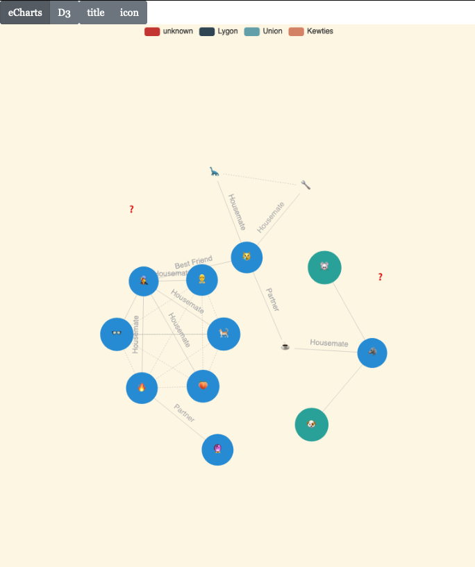

# Germicule


[](https://codecov.io/gh/derwentx/germicule)

React web app for visualising your contacts and their covid risk factors

Risk factors are based off [this Medium article](https://medium.com/@evelindacker/covid-care-e2ede67428d4)



[Python prototype](https://github.com/derwentx/python-germicule/)

## Installing

```bash
npm install
```

## Testing

re-test on changes

```bash
npm test
```

## Building

```bash

```

## Usage - Development mode

recompile on change, and host a development server on port 3000

```bash
npm run start:local
```

## Usage - Production

host a production server on port the value of environment variable `PORT` or `8080` if not set.

```bash
npm run start
```